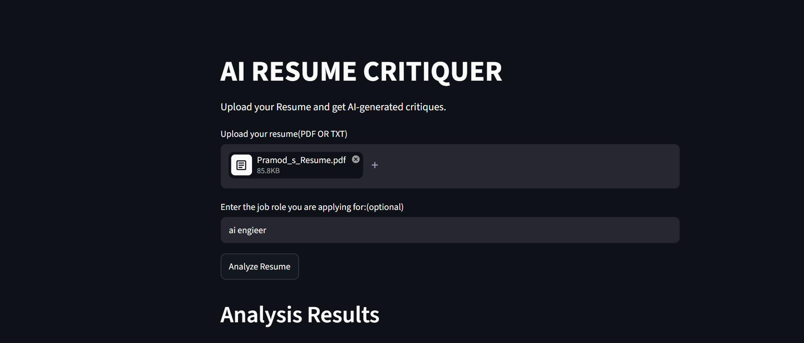

# AI Resume Critiquer

An AI-powered resume analysis tool built with Python, Streamlit, and Google's Gemini API.

Users can upload a resume in PDF or TXT format and receive AI-generated feedback on content quality, skills presentation, experience descriptions, and overall effectiveness for job applications.

## Screenshot




## Features

* Upload resumes in PDF or TXT format
* Extract text from uploaded files
* Analyze resumes using Gemini AI
* Get structured feedback and improvement suggestions
* Optional job role targeting for personalized recommendations
* Simple and interactive Streamlit interface

## Tech Stack

* Python
* Streamlit
* Google Gemini API
* PyPDF2
* Python Dotenv

## Project Structure

```text
Ai-Resume-Critiquer/
│
├── main.py
├── pyproject.toml
├── README.md
├── .env
├── .gitignore
└── .python-version
```

## Installation

Clone the repository:

```bash
git clone <repository-url>
cd Ai-Resume-Critiquer
```

Install dependencies:

```bash
uv sync
```

Create a `.env` file:

```env
GOOGLE_API_KEY=your_api_key_here
```

## Running the Application

Start the Streamlit application:

```bash
uv run streamlit run main.py
```

The application will open in your browser.

## How It Works

1. User uploads a resume.
2. The application extracts text from the file.
3. A prompt is generated based on the resume content and job role.
4. Gemini analyzes the resume.
5. AI-generated feedback is displayed to the user.

## Future Improvements

* ATS score calculation
* Resume-to-job description matching
* Skills gap analysis
* Resume keyword optimization
* Export analysis as PDF
* Resume improvement suggestions with scoring

## Learning Outcomes

This project demonstrates:

* File handling in Python
* PDF text extraction
* Prompt engineering
* API integration
* Streamlit application development
* AI-powered workflow implementation

## Author

Pramod B
